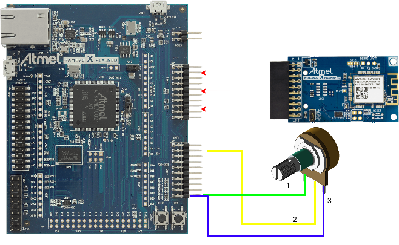

# IoT-Request-System

Developers: Pedro Paulo Telho and Matheus Pellizzon.

 
<h3>Description:</h3>

Our project consists of getting digital and analogical signals from a SAM E70 ARM PROCESSOR and sending it via REST API to an EC2 server disposed at AWS structure.

<h4>Required system:</h4>
<ul>
  <li>Windows 10</li>
  <li><a href="http://studio.download.atmel.com/7.0.2397/as-installer-7.0.2397-web.exe">Atmel Studio</a></li>
  <li><a href="https://gallery.microchip.com/api/v2/package/EFC4C002-63A3-4BB9-981F-0C1ACAF81E03/2.8.4">Serial Port for AtmelStudio</a></li>
</ul>
<h4>Components:</h4>
<ul>
  <li>1x SAM E70 Xplained (ATMEL)</li>
  <li>1x WIFI - ATWINC1500-XPRO (Wifi module)
    Specifications:
    <ul>
      <li>IEEE 802.11 b/g/n 20MHz (1x1) solution</li>
      <li>Supports IEEE 802.11 WEP, WPA, and WPA2 Security</li>
      <li>SPI, UART, and I2C host interface</li>
    </ul>
  </li>
  <li>Jumpers</li>
  <li>1x potentiometer B10K</li>
</ul>
 
<h4>First steps:</h4>

To implement our code it is necessary to connect the Wifi module at port EXT1 and the potentiometer in EXT2 as follows on image below.

